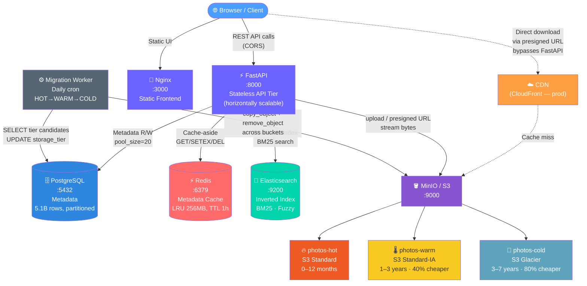
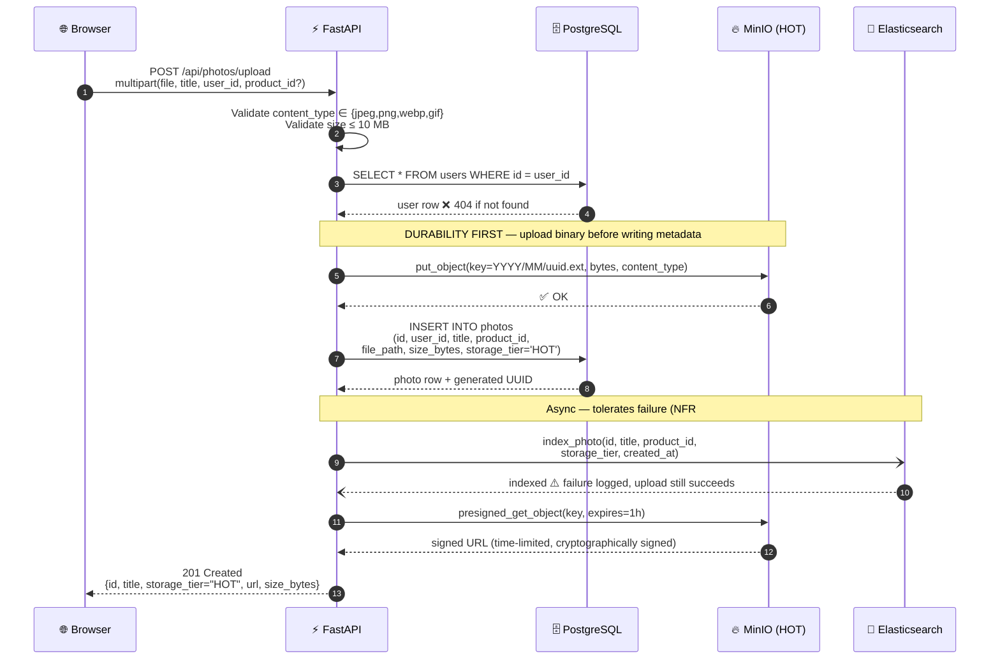
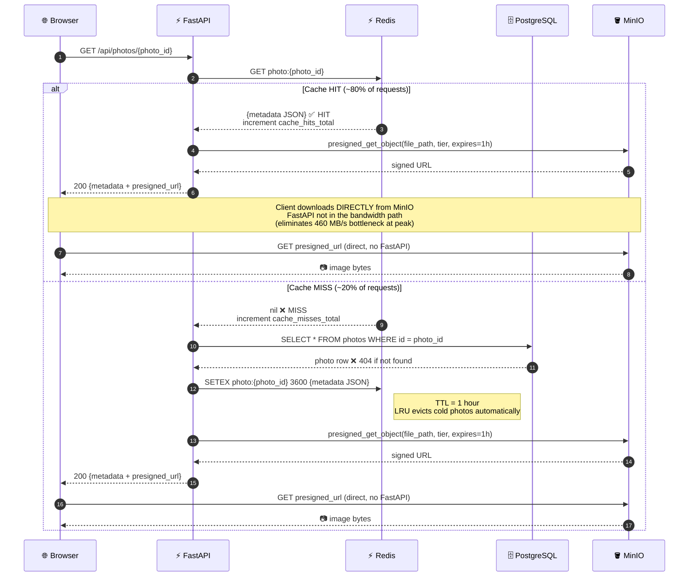
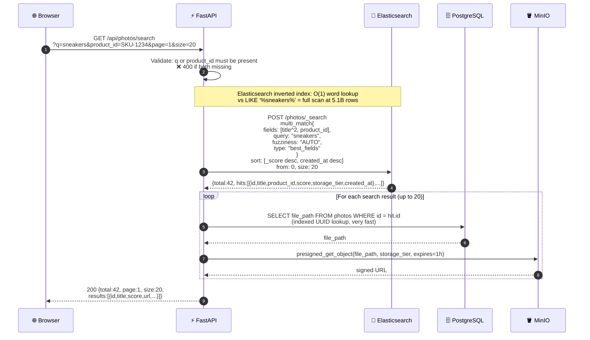
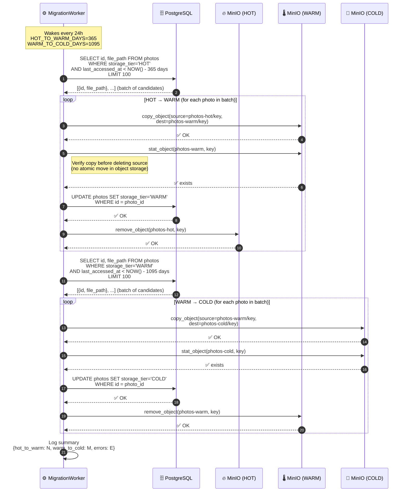
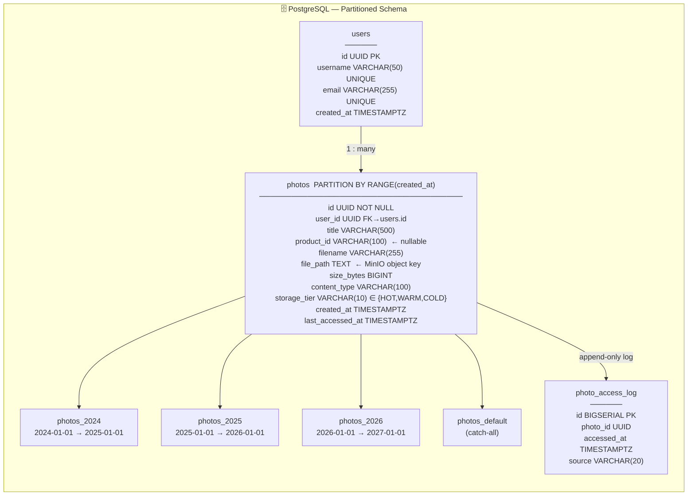

# Photo Sharing System — System Design

> **Scale:** 500M users · 1M DAU · 2M photos/day · ~1.02 PB over 7 years · 200ms read SLA

---

## Table of Contents
1. [Capacity Estimation](#1-capacity-estimation)
2. [Database & Storage Choices](#2-database--storage-choices)
3. [High-Level Architecture](#3-high-level-architecture)
4. [Upload Flow](#4-upload-flow)
5. [View Photo Flow (Cache-Aside)](#5-view-photo-flow-cache-aside)
6. [Search Flow](#6-search-flow)
7. [Download Flow](#7-download-flow)
8. [Storage Tier Migration Flow](#8-storage-tier-migration-flow)
9. [Database Schema](#9-database-schema)
10. [Key Design Patterns](#10-key-design-patterns)
11. [Storage Tiering & Cost](#11-storage-tiering--cost)
12. [API Reference](#12-api-reference)

---

## 1. Capacity Estimation

> Always start here in a system design interview. Numbers drive every architectural decision.

| Metric | Calculation | Result |
|--------|-------------|--------|
| Write throughput (avg) | 2,000,000 ÷ 86,400 | **~23 photos/sec** |
| Write throughput (peak 3×) | 23 × 3 | **~70 photos/sec** |
| Read throughput (avg) | 23 × 100 (read:write ratio) | **~2,300 reads/sec** |
| Read throughput (peak) | 2,300 × 3 | **~6,900 reads/sec** |
| Storage per day | 2M × 200 KB | **400 GB/day** |
| Storage per year | 400 GB × 365 | **~146 TB/year** |
| **Storage over 7 years** | 146 TB × 7 | **~1.02 PB** |
| Metadata DB rows | 2M/day × 365 × 7 | **~5.1 billion rows** |
| Metadata DB size | 5.1B × 500 B/row | **~2.5 TB** |
| Peak read bandwidth | 2,300 × 200 KB | **~460 MB/s = 3.68 Gbps** |

**Key conclusions from the math:**
- **3.68 Gbps peak** → CDN is mandatory; the backend cannot absorb this bandwidth
- **5.1 billion rows** → table partitioning (or sharding) is required; a single unpartitioned table would be unusable
- **~1 PB** → storage tiering is critical; storing all photos in the hot tier costs ~$23K/month vs ~$9.3K/month with tiering

---

## 2. Database & Storage Choices

| Store | Role | Why Chosen | Why Not the Alternative |
|-------|------|-----------|------------------------|
| **PostgreSQL** | Photo metadata — source of truth | ACID transactions, rich secondary indexes, range partitioning by year, familiar SQL | Cassandra: overkill at 23 writes/sec; no ACID; limited secondary indexes; higher operational complexity |
| **MinIO / S3** | Photo binary blobs | 5× cheaper than RDS storage, native CDN integration, byte-range streaming, no DB VACUUM impact | DB BLOBs: balloon VACUUM time, no CDN, no streaming, 5× more expensive |
| **Redis** | Metadata cache (cache-aside) | Sub-millisecond reads vs ~5ms DB; LRU eviction matches photo access patterns; shared across all backend instances | In-process cache: not shared across horizontally-scaled instances |
| **Elasticsearch** | Full-text search on title + product_id | Inverted index gives O(1) word lookup; BM25 relevance scoring; fuzzy matching; scales horizontally | `LIKE '%q%'`: full sequential scan at 5B rows, no index possible, unranked results |

---

## 3. High-Level Architecture



**Service dependency startup order** (from `docker-compose.yml`):
```
postgres (healthy) ─┐
redis    (healthy) ─┼──► backend ──► migration-worker
elasticsearch (healthy) ─┤
minio    (healthy) ──► minio-init (creates 3 buckets) ─┘
```

---

## 4. Upload Flow

> **File:** `backend/services/photo_service.py → upload_photo()`
> **Ordering principle:** MinIO upload first (durability before metadata). If MinIO fails, no orphan DB row.



**Why this order matters:**

| Step | Failure Mode | Impact |
|------|-------------|--------|
| MinIO before PostgreSQL | MinIO fails → no DB write | ✅ No orphan metadata |
| PostgreSQL before Elasticsearch | ES fails → photo still accessible | ✅ Search eventually consistent |
| If PostgreSQL fails after MinIO | Orphan object in MinIO | ⚠️ Acceptable — background cleanup in prod |

---

## 5. View Photo Flow (Cache-Aside)

> **File:** `backend/services/photo_service.py → get_photo()`
> **Pattern:** Cache-aside (lazy loading) with Redis TTL = 1 hour



**Cache-aside vs alternatives:**

| Pattern | Read path | Write path | When to use |
|---------|-----------|------------|-------------|
| **Cache-aside** ← this | Cache → miss → DB → populate | Write DB → invalidate cache | Read-heavy (100:1), resilient to cache failure |
| Write-through | Always from cache | Write DB + cache | Balanced read/write, always-warm cache |
| Write-behind | Always from cache | Write cache → async flush to DB | Write-heavy, tolerate data loss risk |

**Impact at scale:**
- 80% hit ratio at 2,300 reads/sec → only **460 DB reads/sec** (trivial for PostgreSQL)
- Redis 256 MB headroom ≫ ~50 MB needed for hot metadata

---

## 6. Search Flow

> **Files:** `backend/services/search_service.py`, `backend/services/photo_service.py → search_photos()`
> **Pattern:** Dual-write (PostgreSQL source of truth + Elasticsearch search replica)



**Elasticsearch query anatomy:**
```json
{
  "query": {
    "bool": {
      "must": [
        {
          "multi_match": {
            "query": "sneakers",
            "fields": ["title^2", "product_id"],
            "fuzziness": "AUTO"
          }
        },
        { "term": { "product_id": "SKU-1234" } }
      ]
    }
  },
  "sort": [{ "_score": "desc" }, { "created_at": "desc" }],
  "from": 0, "size": 20
}
```

**Dual-write consistency trade-off:**
- PostgreSQL = authoritative (ACID)
- Elasticsearch = replica (eventual consistency, NFR #3 compliant)
- Gap window: seconds to minutes depending on retry strategy
- Production option: async indexing via Kafka/SQS for guaranteed delivery

---

## 7. Download Flow

> **File:** `backend/services/photo_service.py → download_photo()`
> **Note:** This endpoint streams bytes through the backend. For production scale, use the presigned URL from `GET /api/photos/{id}` instead.

```mermaid
sequenceDiagram
    autonumber
    participant B as 🌐 Browser
    participant A as ⚡ FastAPI
    participant PG as 🗄️ PostgreSQL
    participant M as 🪣 MinIO

    B->>A: GET /api/photos/{photo_id}/download

    A->>PG: SELECT file_path, content_type, storage_tier<br/>FROM photos WHERE id = photo_id
    PG-->>A: file_path, content_type, storage_tier  ❌ 404 if not found

    Note over A,M: Backend resolves correct bucket from storage_tier:<br/>HOT→photos-hot | WARM→photos-warm | COLD→photos-cold

    A->>M: get_object(bucket=photos-{tier}, object=file_path)
    M-->>A: 📷 byte stream (supports Range requests)

    A-->>B: 200 binary response<br/>Content-Type: image/jpeg<br/>Content-Disposition: attachment; filename={photo_id}

    Note over A,M: ⚠️ Backend in bandwidth path here<br/>At 460 MB/s peak this is a bottleneck<br/>Use presigned URL (GET /{id}) for production
```

**Streaming vs Presigned URL trade-off:**

| Approach | Bandwidth | Use case |
|----------|-----------|----------|
| **Stream through backend** ← this | Backend absorbs all bandwidth | Server-side access control, download logging |
| **Presigned URL** (`GET /{id}`) | Zero backend bandwidth | Production at scale — CDN caches the URL |

---

## 8. Storage Tier Migration Flow

> **Files:** `backend/services/tier_migration.py`, `backend/scripts/tier_migration_cron.py`
> **Schedule:** Every 24 hours (configurable via `MIGRATION_INTERVAL_SECONDS`)



**Copy-then-delete safety rationale:**
Object storage has no atomic rename/move. The sequence must be:
1. **Copy** → destination bucket
2. **Verify** → `stat_object` confirms copy exists
3. **Update DB** → source of truth updated
4. **Delete** → source object removed

If the worker crashes between steps 2 and 4, the object exists in both buckets (wasted space, not data loss). On next run, the DB still shows old tier, so migration retries safely.

---

## 9. Database Schema



**Indexes and their query patterns:**

| Index | Columns | Type | Query Pattern |
|-------|---------|------|---------------|
| `idx_photos_id` | `(id, created_at)` | UNIQUE | Fetch photo by UUID |
| `idx_photos_user_created` | `(user_id, created_at DESC)` | B-tree composite | User gallery pagination |
| `idx_photos_product_id` | `(product_id, created_at DESC) WHERE product_id IS NOT NULL` | **Partial** | Product photo lookup |
| `idx_photos_tier_accessed` | `(storage_tier, last_accessed_at)` | B-tree | Migration cron candidates |

**Why time-based partitioning?**

| Operation | Without Partitioning | With Partitioning |
|-----------|---------------------|-------------------|
| `WHERE created_at > '2026-01-01'` | Scan 5.1B rows | Scan only `photos_2026` (730M rows) |
| Archive 2024 data | `DELETE` 730M rows (hours) | `DROP TABLE photos_2024` (milliseconds) |
| VACUUM / ANALYZE | Full 5.1B row table | Per-partition only |
| Index rebuild | Full 5.1B row table | Per-partition only |

---

## 10. Key Design Patterns

### Cache-Aside (Lazy Loading)
**File:** `backend/services/cache_service.py`

```
Read:   Redis GET → HIT: return | MISS: DB SELECT → Redis SETEX TTL=3600 → return
Write:  DB INSERT → Redis DEL (invalidate, not overwrite)
```
Choosing DEL over SET on write avoids the race condition where a stale cached value overwrites a fresher DB value during concurrent writes.

---

### Presigned URL (Bandwidth Elimination)
**File:** `backend/services/storage_service.py`

```
Client → FastAPI → [DB lookup + URL generation, ~2-8ms] → return presigned URL
Client → MinIO DIRECTLY [download at full S3 speed, bypasses FastAPI]
```
At 460 MB/s peak, routing bytes through FastAPI would require 23× the server capacity. Presigned URLs solve this at zero backend cost.

---

### Dual-Write (PostgreSQL + Elasticsearch)
**File:** `backend/services/photo_service.py → upload_photo()`

```
Upload: PostgreSQL INSERT (ACID, source of truth)
        → Elasticsearch index (async, tolerates failure)
Search: Elasticsearch query → PostgreSQL file_path lookup
```
Consistency window = time between ES failure and retry. Acceptable per NFR #3 (eventual consistency).

---

### Time-Based Table Partitioning
**File:** `backend/db/migrations/001_initial.sql`

```sql
-- One partition per year — DROP TABLE for instant archival
CREATE TABLE photos_2024 PARTITION OF photos
  FOR VALUES FROM ('2024-01-01') TO ('2025-01-01');
```
At 7 years × 2M photos/day, this is the difference between a 5.1B-row monolith and 7 manageable ~730M-row partitions with automatic query pruning.

---

### Copy-Then-Delete (No Atomic Move in Object Storage)
**File:** `backend/services/storage_service.py → move_to_tier()`

```
copy_object(src, dst) → stat_object(dst) [verify] → UPDATE DB tier → remove_object(src)
```
S3 / MinIO has no rename primitive. This four-step sequence with a verification guard ensures data integrity even if the worker crashes mid-migration.

---

### Background Worker (Separation of Concerns)
**File:** `backend/scripts/tier_migration_cron.py`

The migration worker is a fully independent service with its own container. API failures don't affect migration. Migration slowdowns don't affect API latency. Each can be scaled, restarted, or scheduled independently.

---

## 11. Storage Tiering & Cost

| Tier | Age | Bucket | S3 Equivalent | $/GB/month | Estimated Data | Monthly Cost |
|------|-----|--------|---------------|-----------|----------------|-------------|
| 🔥 HOT | 0–12 months | `photos-hot` | S3 Standard | $0.023 | ~146 TB | ~$3,358 |
| 🌡️ WARM | 1–3 years | `photos-warm` | S3 Standard-IA | $0.0125 | ~292 TB | ~$3,650 |
| 🧊 COLD | 3–7 years | `photos-cold` | S3 Glacier | $0.004 | ~584 TB | ~$2,336 |
| | | | **Total with tiering** | | **~1.02 PB** | **~$9,344/month** |
| | | | Without tiering (all HOT) | $0.023 | ~1.02 PB | **~$23,460/month** |

**Annual savings from tiering: ~$169,000**

Migration thresholds (configurable in `.env`):
- `HOT_TO_WARM_DAYS=365` — not accessed in 1 year → move to WARM
- `WARM_TO_COLD_DAYS=1095` — not accessed in 3 years → move to COLD

---

## 12. API Reference

| Method | Path | Description | Key Request Fields |
|--------|------|-------------|-------------------|
| `POST` | `/api/photos/upload` | Upload a photo | `file` (multipart), `title`, `user_id`, `product_id?` |
| `GET` | `/api/photos/{id}` | Get metadata + presigned URL | path `photo_id` (UUID) |
| `GET` | `/api/photos/{id}/download` | Stream raw photo bytes | path `photo_id` (UUID) |
| `GET` | `/api/photos/search` | Elasticsearch full-text search | `q?`, `product_id?`, `page`, `size` |
| `GET` | `/health` | All dependency health status | — |
| `GET` | `/metrics` | Prometheus-format metrics | — |
| `GET` | `/` | Service info + endpoint map | — |

**Services & Ports (local dev):**

| Service | URL | Credentials |
|---------|-----|-------------|
| Frontend UI | http://localhost:3000 | — |
| API + Swagger docs | http://localhost:8000/docs | — |
| MinIO Console | http://localhost:9001 | `minioadmin` / `minioadmin123` |
| PostgreSQL | `localhost:5432` | `photouser` / `photopass` / `photodb` |
| Redis | `localhost:6379` | — |
| Elasticsearch | http://localhost:9200 | — |

---

*Generated for [hegde86vinay/photo-system](https://github.com/hegde86vinay/photo-system)*
